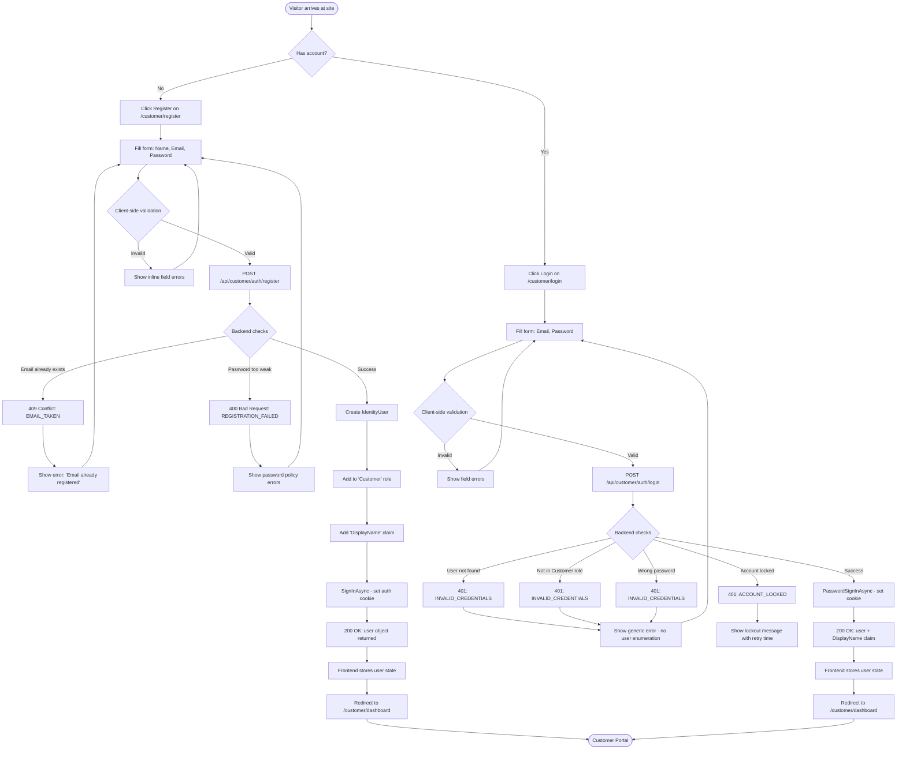
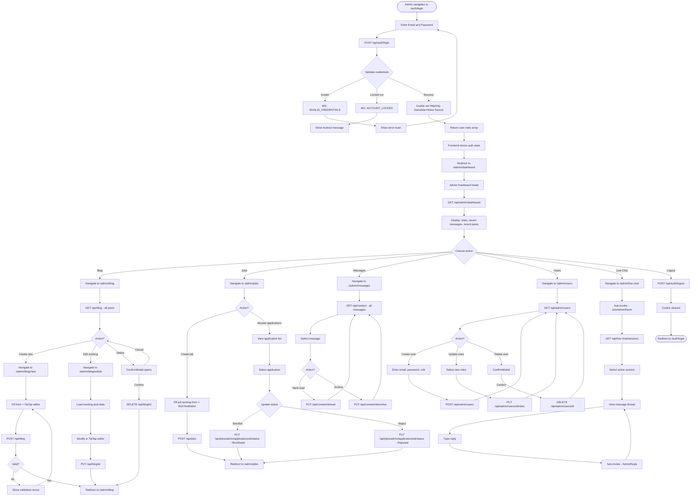
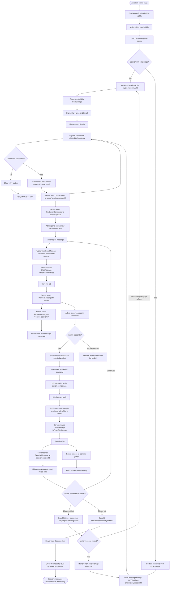
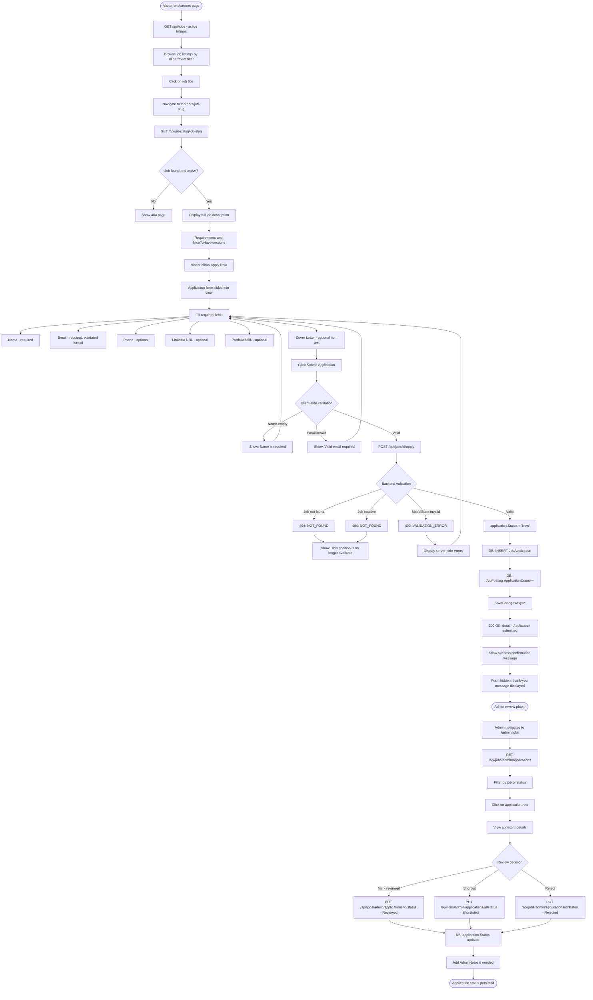
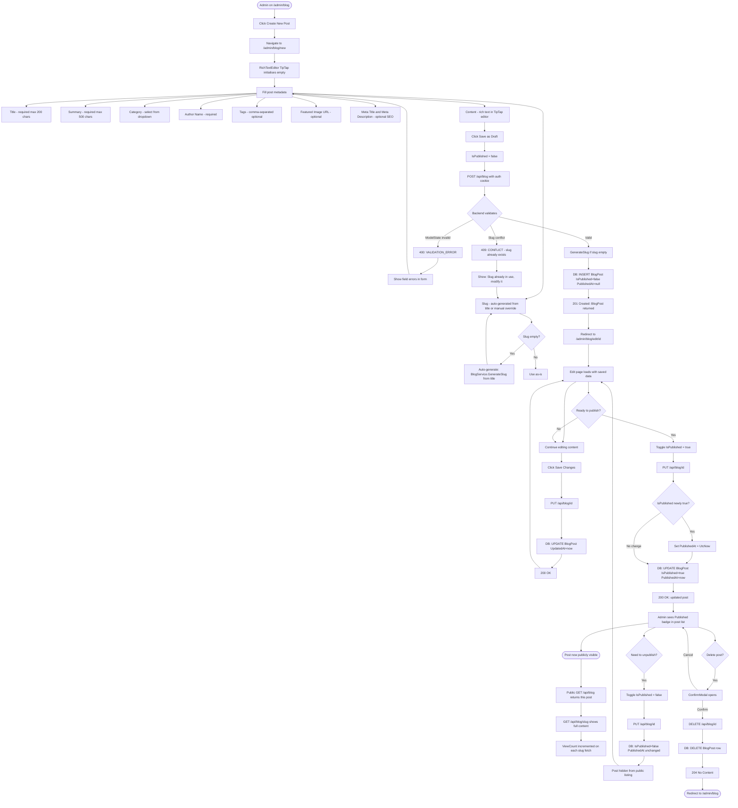
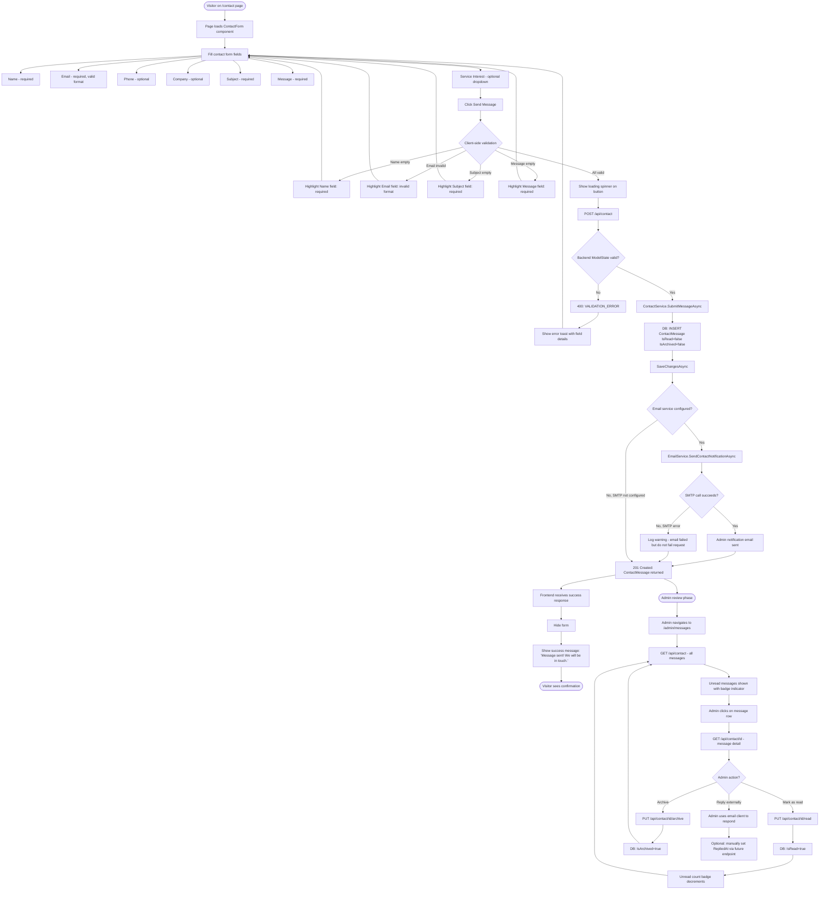

# Flowcharts — SLP Systems Portal

**Version:** 1.0  
**Date:** 2026-03-03  
**Format:** Mermaid flowchart syntax (renders on GitHub)

---

## Table of Contents

1. [User Registration and Login Flow (Customer)](#1-user-registration-and-login-flow-customer)
2. [Admin Login and Content Management Workflow](#2-admin-login-and-content-management-workflow)
3. [Live Chat Session Lifecycle](#3-live-chat-session-lifecycle)
4. [Job Application Submission Workflow](#4-job-application-submission-workflow)
5. [Blog Post Creation and Publish Workflow](#5-blog-post-creation-and-publish-workflow)
6. [Contact Form Submission Flow](#6-contact-form-submission-flow)
7. [Deployment Pipeline Flow](#7-deployment-pipeline-flow)

---

## 1. User Registration and Login Flow (Customer)



---

## 2. Admin Login and Content Management Workflow



---

## 3. Live Chat Session Lifecycle



---

## 4. Job Application Submission Workflow



---

## 5. Blog Post Creation and Publish Workflow



---

## 6. Contact Form Submission Flow



---

## 7. Deployment Pipeline Flow

```mermaid
flowchart TD
    A([Developer pushes commit]) --> B{Target branch?}

    B -- develop or main --> C[GitHub Actions CI workflow triggers]
    B -- feature branch or PR --> C

    C --> D[Job: frontend-lint-build]
    C --> E[Job: backend-build-test]
    C --> F[Job: security-scan - depends on D and E]

    D --> D1[actions/setup-node v4 Node 20]
    D1 --> D2[npm ci - install dependencies]
    D2 --> D3[npm run lint - ESLint]
    D3 --> D4{Lint passed?}
    D4 -- No --> D5[CI fails - block merge]
    D4 -- Yes --> D6[npx tsc --noEmit - type check]
    D6 --> D7{Types valid?}
    D7 -- No --> D5
    D7 -- Yes --> D8[npm run build]
    D8 --> D9{Build succeeded?}
    D9 -- No --> D5
    D9 -- Yes --> D10{Branch = main?}
    D10 -- Yes --> D11[Upload .next build artifact]
    D10 -- No --> D12[Frontend CI done]
    D11 --> D12

    E --> E1[actions/setup-dotnet v4 .NET 8]
    E1 --> E2[dotnet restore]
    E2 --> E3[dotnet build --configuration Release]
    E3 --> E4{Build succeeded?}
    E4 -- No --> E5[CI fails]
    E4 -- Yes --> E6[dotnet test]
    E6 --> E7[dotnet publish to ./publish]
    E7 --> E8{Branch = main?}
    E8 -- Yes --> E9[Upload dotnet publish artifact]
    E8 -- No --> E10[Backend CI done]
    E9 --> E10

    F --> F1[TruffleHog secret scan]
    F --> F2[Trivy filesystem scan HIGH CRITICAL]
    F1 --> F3[Security scan done - continue-on-error]
    F2 --> F3

    D12 --> G{All CI jobs passed?}
    E10 --> G
    F3 --> G

    G -- No --> H[PR blocked or branch build failed]
    G -- Yes, branch = main --> I[Deploy workflow triggers automatically]
    G -- Yes, other branch --> J([CI green - PR can be merged])

    I --> K[Job: build-push-images]
    K --> K1[docker/login-action - GHCR login with GITHUB_TOKEN]
    K1 --> K2[docker/setup-buildx-action]

    K2 --> K3[Build backend Docker image]
    K3 --> K4[docker/build-push-action context ./SLPSystems/SLPSystems.Web]
    K4 --> K5[Tag: sha-shortsha and latest]
    K5 --> K6[Push to ghcr.io/owner/slp-backend]

    K2 --> K7[Build frontend Docker image]
    K7 --> K8[docker/build-push-action with NEXT_PUBLIC_API_URL build-arg]
    K8 --> K9[Tag: sha-shortsha and latest]
    K9 --> K10[Push to ghcr.io/owner/slp-frontend]

    K6 --> L[Job: deploy - depends on build-push-images]
    K10 --> L

    L --> L1[appleboy/ssh-action connects to server]
    L1 --> L2[SSH: cd /opt/slp-portal]
    L2 --> L3[SSH: git pull origin main]
    L3 --> L4[SSH: docker login ghcr.io]
    L4 --> L5[SSH: docker compose pull - pull latest images]
    L5 --> L6[SSH: docker compose up -d --remove-orphans]

    L6 --> M{Docker health checks}
    M --> M1[backend: wget /api/health every 30s]
    M --> M2[frontend: wget / every 30s]

    M1 --> M3{Backend healthy?}
    M3 -- Yes after 3 retries --> M4[Backend container running]
    M3 -- No after 3 retries --> M5[Docker restarts container automatically]
    M5 --> M1

    M2 --> M6{Frontend healthy?}
    M6 -- Yes --> M7[Frontend container running]
    M6 -- No --> M8[Docker restarts frontend container]
    M8 --> M2

    M4 --> N[SSH: docker image prune -f]
    M7 --> N
    N --> O[SSH: echo Deployment complete at date]
    O --> P([Production site updated])

    L6 --> Q[Nginx reverse proxy routes traffic]
    Q --> Q1[Port 80 and 443 - public]
    Q1 --> Q2[/api/* and /hubs/* → backend:5062]
    Q1 --> Q3[/* → frontend:3000]
    Q2 --> P
    Q3 --> P
```

