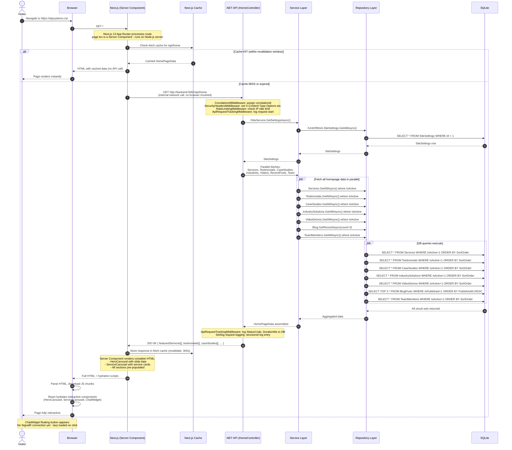
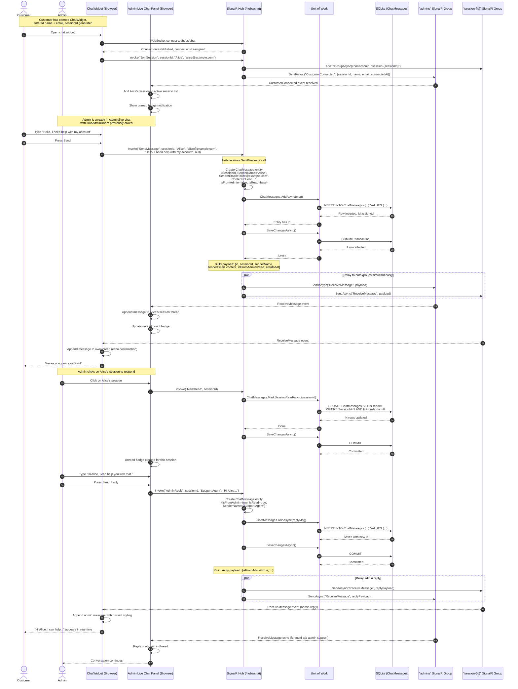
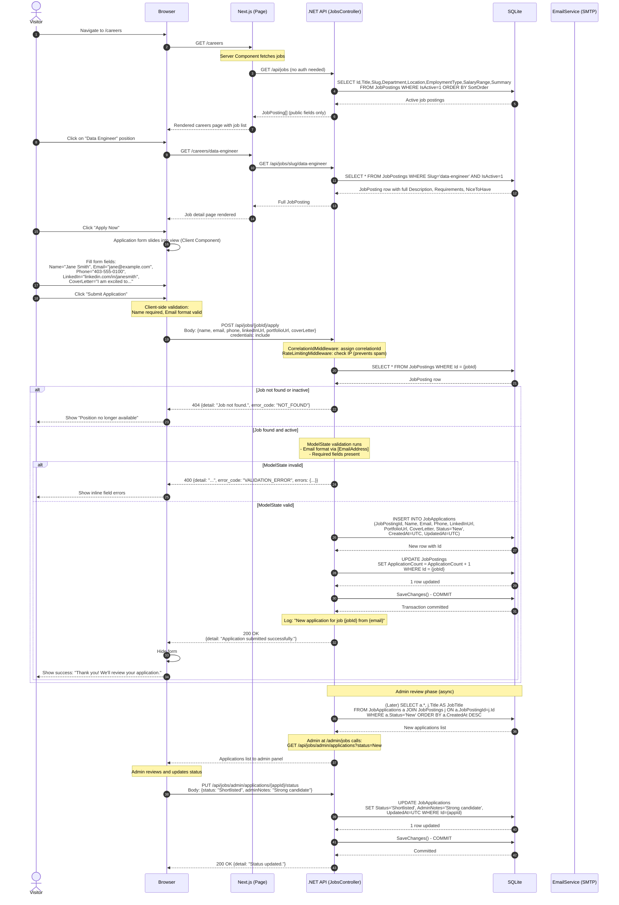
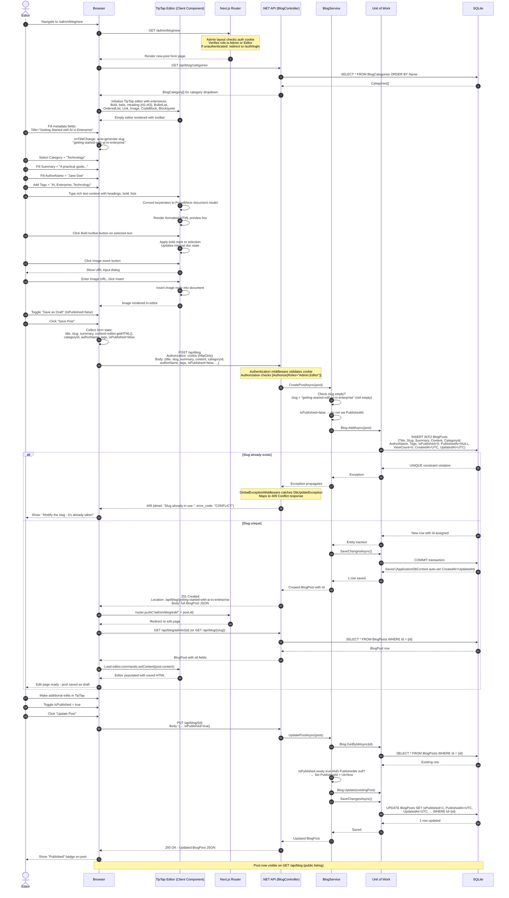
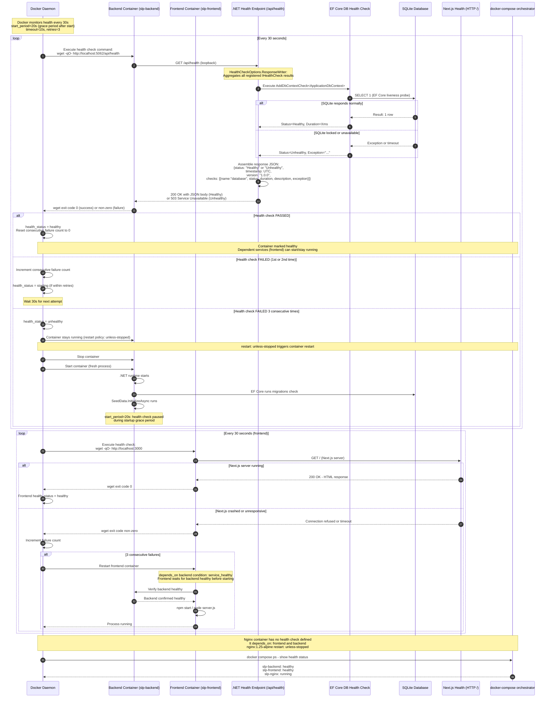

# Sequence Diagrams — SLP Systems Portal

**Version:** 1.0  
**Date:** 2026-03-03  
**Format:** Mermaid sequenceDiagram syntax (renders on GitHub)

---

## Table of Contents

1. [Admin Login Sequence](#1-admin-login-sequence)
2. [Public Page Load with SSR](#2-public-page-load-with-ssr)
3. [Live Chat Message Send](#3-live-chat-message-send)
4. [Job Application Submit](#4-job-application-submit)
5. [Admin Creating a Blog Post with Rich Text](#5-admin-creating-a-blog-post-with-rich-text)
6. [Docker Health Check Sequence](#6-docker-health-check-sequence)

---

## 1. Admin Login Sequence

```mermaid
sequenceDiagram
    autonumber
    actor Admin
    participant Browser
    participant NextJS as Next.js (App Router)
    participant API as .NET API (AuthController)
    participant Identity as ASP.NET Identity
    participant DB as SQLite (AspNetUsers)
    participant Cookie as Browser Cookie Jar

    Admin->>Browser: Navigate to /auth/login
    Browser->>NextJS: GET /auth/login
    NextJS-->>Browser: Render login page (Server Component)

    Admin->>Browser: Enter email + password, click Login
    Browser->>NextJS: Client-side form submit

    Note over Browser,NextJS: Client validates: email not empty, password not empty

    Browser->>API: POST /api/auth/login<br/>Body: {email, password}<br/>credentials: include
    
    Note over API: CorrelationIdMiddleware assigns correlationId<br/>SecurityHeadersMiddleware adds security headers<br/>RateLimitingMiddleware checks per-IP count

    API->>Identity: _userManager.FindByEmailAsync(email)
    Identity->>DB: SELECT * FROM AspNetUsers WHERE Email = ?
    DB-->>Identity: User row or null
    Identity-->>API: IdentityUser or null

    alt User not found
        API-->>Browser: 401 Unauthorized<br/>{detail: "Invalid email or password.",<br/>error_code: "INVALID_CREDENTIALS",<br/>correlation_id: "..."}
        Browser-->>Admin: Show error toast
    else User found
        API->>Identity: _signInManager.PasswordSignInAsync(user, password, isPersistent=false, lockoutOnFailure=true)
        Identity->>DB: Verify PasswordHash (BCrypt)
        Identity->>DB: Check LockoutEnabled + AccessFailedCount
        DB-->>Identity: Verification result

        alt Wrong password
            Identity->>DB: UPDATE AspNetUsers SET AccessFailedCount++
            DB-->>Identity: Updated
            Identity-->>API: SignInResult.Failed
            API-->>Browser: 401 {error_code: "INVALID_CREDENTIALS"}
            Browser-->>Admin: Show error toast
        else Account locked
            Identity-->>API: SignInResult.IsLockedOut = true
            API-->>Browser: 401 {error_code: "ACCOUNT_LOCKED"}
            Browser-->>Admin: Show lockout message
        else Sign-in success
            Identity->>DB: UPDATE AspNetUsers SET AccessFailedCount=0
            Identity->>DB: INSERT AspNetUserTokens (session token)
            DB-->>Identity: Saved
            Identity-->>API: SignInResult.Succeeded

            API->>Identity: _userManager.GetRolesAsync(user)
            Identity->>DB: SELECT r.Name FROM AspNetRoles r JOIN AspNetUserRoles ur...
            DB-->>Identity: roles[] e.g. ["Admin"]
            Identity-->>API: roles[]

            Note over API: SignInManager sets auth cookie internally via IAuthenticationService
            API->>Cookie: Set-Cookie: .AspNetCore.Identity.Application=<encrypted_ticket>;<br/>HttpOnly; Secure; SameSite=None; Max-Age=28800

            API-->>Browser: 200 OK<br/>{detail: "Login successful.",<br/>user: {id, email, userName, roles[]}}

            Browser->>Cookie: Store auth cookie
            Browser->>NextJS: Redirect to /admin/dashboard
            NextJS-->>Browser: Render admin dashboard (with cookie attached)
            Browser-->>Admin: Admin dashboard displayed
        end
    end
```

---

## 2. Public Page Load with SSR



---

## 3. Live Chat Message Send



---

## 4. Job Application Submit



---

## 5. Admin Creating a Blog Post with Rich Text



---

## 6. Docker Health Check Sequence



